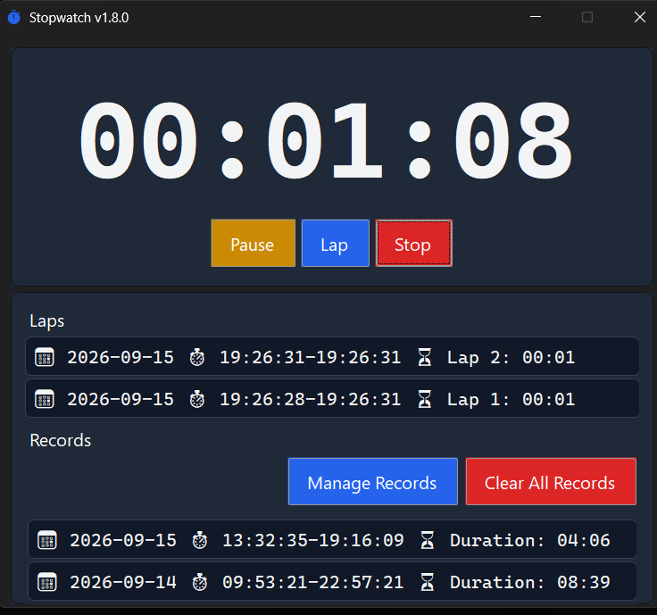

# Stopwatch



Tiny stopwatch built with C#, .NET 10 and WinForms with record keeping and session resume.

## Features

- Start, pause, continue, add lap splits, and stop a timing session.
- Elapsed time shown in the main window and in a runtime-rendered system tray icon (minutes below
  one hour, an `h:mm` label from one to nine hours, whole hours from ten hours to one day, days
  thereafter), with a tooltip that always shows the full unbounded `HH:mm:ss` duration.
- Close-to-tray behavior: the main window is hidden from the taskbar when closed or minimized, and
  a single left click on the tray icon restores it. The tray's own context menu mirrors the valid
  timer actions and is the explicit exit path.
- Completed sessions are persisted to a local SQLite database. The main window previews the five
  newest records, and a modeless records manager exposes the full history, paginated ten per page,
  with confirmed per-record deletion and confirmed clear-all.
- Laps are kept in memory during a session and included in a periodic autosaved snapshot (interval
  configurable in `settings.json`, five minutes by default), plus an immediate save on pause.
  Restoring a snapshot always resumes in the paused state, so time spent while the app was closed
  is never counted.
- Stop asks for confirmation once a session has run for a configurable time
  (`StopConfirmationAfterMinutes` in `settings.json`, five minutes by default, `0` to disable): the
  clock pauses while asking and resumes if you cancel.
- Single-instance enforcement: launching a second copy activates the existing window, even if it is
  hidden in the tray.
- Window-scoped keyboard shortcuts: `Space` (Start/Pause/Continue), `Shift+Space` (Lap), `Enter`
  (Stop).
- Follows the live Windows light/dark theme, scales for per-monitor DPI, sizes the window to its
  content, centers it whenever opened, and shows the application version in the window title.
- Fully offline: no network calls, telemetry, analytics, auto-update, or crash reporting.

## Technical specifications

- **Language / runtime:** C# 13 on **.NET 10** (`net10.0-windows`).
- **OS:** **Windows 11** only (framework-dependent — the target machine needs the .NET 10 Desktop
  Runtime installed).
- **Architecture:** x64 only.
- **UI framework:** Windows Forms (WinForms), with `Application.SetColorMode` for live theme
  switching and `PerMonitorV2` high-DPI awareness.
- **Storage:** a single local SQLite file at `%LOCALAPPDATA%\StopwatchApp\stopwatch.db`, created on
  first run.
- **Testing:** xUnit, 128 tests covering timer state transitions, formatting, layout helpers, and
  SQLite persistence.

## Building

Requires the [.NET 10 SDK](https://dotnet.microsoft.com/download) on Windows 11.

```powershell
dotnet build -c Release
```

## Running

```powershell
dotnet run --project StopwatchApp -c Release
```

Or run the built executable directly:

```powershell
StopwatchApp\bin\x64\Release\net10.0-windows\win-x64\StopwatchApp.exe
```

## Testing

```powershell
dotnet test
```

## Libraries and references

- [Dapper](https://github.com/DapperLib/Dapper) — lightweight object mapping over
  `Microsoft.Data.Sqlite` query results.
- [Microsoft.Data.Sqlite](https://learn.microsoft.com/dotnet/standard/data/sqlite/) — the SQLite
  ADO.NET provider used for all persistence.
- [Microsoft.Extensions.TimeProvider.Testing](https://learn.microsoft.com/dotnet/api/microsoft.extensions.time.testing) —
  `FakeTimeProvider`, used in tests to drive the timer deterministically without real sleeps.
- [xUnit](https://xunit.net/) — the test framework for the `StopwatchApp.Tests` project.
- [CSharpier](https://csharpier.com/) — opinionated code formatter used across the repository.
- [Fluent System Icons](https://github.com/microsoft/fluentui-system-icons) — source of the
  application icon (see `StopwatchApp/Assets/NOTICE.md` for attribution and license).
- Windows Forms and the .NET 10 SDK-provided high-DPI/dark-mode APIs
  (`Application.SetColorMode`, `ApplicationHighDpiMode`).

## License

Public domain — see [LICENSE](LICENSE).

By Jorge Ivan Burgos Aguilar
